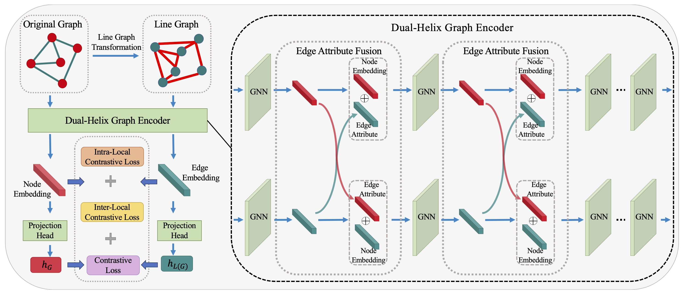

# Molecular Graph Contrastive Learning with Line Graph
Xueyuan Chen<sup>\*</sup>, Shangzhe Li<sup>\*</sup>, Ruomei Liu, Bowen Shi, Jiaheng Liu, Junran Wu<sup>^</sup>, Ke Xu

This code reproduces the experimental results obtained with the LEMON as presented in the Pattern Recognition paper.


## Overview

In common molecular graph contrastive learning, while random or learnable data corruption and domain knowledge incorporation are effective, these approaches also lead to altered molecular semantics and limited generalization capability.

In this work, we relate the *L*in*E* graph with *MO*lecular graph co*N*trastive learning and propose a novel method termed
LEMON. Specifically, **by contrasting the given graph with the corresponding
line graph**, the graph encoder can freely encode the molecular semantics with-
out omission.


<p align="middle">

</p>

## Dependencies & Dataset

* python 3.7.11
* pytorch torch-1.8.1+cu101
* torch-geometric 2.0.1
* rkdit 2022.09.1
* networkx 2.6.3
* tqdm 4.64.0

All the necessary data files can be downloaded from the following links.

For the chemistry dataset, download from [chem data](https://snap.stanford.edu/gnn-pretrain/data/chem_dataset.zip) (2.5GB), unzip it, and put it under chem/.


## Training & Evaluation
### Pre-training: ###
```
python pretrain.py --alpha $Alpha --beta $Beta

hyper-parameters:
--alpha [0.001, 0.01, 0, 1, 10, 100]: 
	the hyper-parameter controls the weight of inter contrastive loss 
--beta  [0.001, 0.01, 0, 1, 10, 100]:
	the hyper-parameter controls the weight of intra contrastive loss 
```


### Finetuning: ###
```
python finetune.py --alpha $Alpha \ 
                   --beta $Beta \
                   --model_epoch $Epoch \
                   --dataset $Dataset \
                   --runseed $Seed \
                   --eval_type $Type
 
hyper-parameters:
--alpha [0.001, 0.01, 0, 1, 10, 100]: 
	the hyper-parameter to select the pre-trained version
--beta  [0.001, 0.01, 0, 1, 10, 100]:
	the hyper-parameter to select the pre-trained version                 
--model_epoch [20, 40, 60, 80, 100]:
	the hyper-parameter to select the pre-trained version    
--dataset [bace, sider, clintox, bbbp, tox21, toxcast, hiv, muv]
	the downstream test dataset
--runsed [0, 1, 3, 4, 5]:
	run five rounds
--eval_type ['graph', 'line_graph', 'hybird']:
	the chosen embedding for final prediction    
```
Results will be recorded in ```log/```.


## Citation

If you found the provided code with our paper useful in your work, we kindly request that you cite our work. 

```
@article{chen2025molecular,
  title={Molecular Graph Contrastive Learning with Line Graph},
  author={Chen, Xueyuan and Li, Shangzhe and Liu, Ruomei and Shi, Bowen and Liu, Jiaheng and Wu, Junran and Xu, Ke},
  journal={Pattern Recognition},
  year={2025},
  publisher={Elsevier}
}
```

